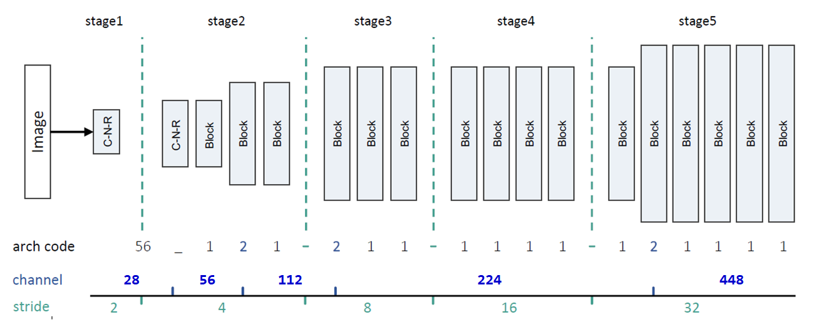

# auto_lane

## 1. 算法介绍

车道线作为路面最主要的指示信息之一，可以有效地引导智能车辆在约束的道路区域内行驶。实时地检测出路面的车道线是智能车辆辅助驾驶系统中的重要环节，有利于协助路径规划、进行道路偏移预警等功能，并且可为精确导航提供参照。auto_lane旨在解决现阶段车道线检测模型计算量大不适宜落地的问题，而设计的一种端到端的车道线架构搜索算法，算法架构如下图所示：


auto_lane分为backbone module，feature fusion module和 head三大组件。backbone module主要用于抽取图像特征，feature fusion module主要用于融合多层次特征，head用于解码生对应的车道线。经过端对端搜索能够获取多个满足部署需求的候选模型，然后根据实际情况进行选择并部署。

## 2. 适用场景

主要面向自动驾驶行业应用，比如辅助驾驶 /自动驾驶系统的感知模块、AR导航、高精度地图辅助制图等对于车道线检测算法具有迫切落地需求的场景。

## 3. 算法原理

1. 算法搜索原理

   纵观现阶段的搜索方法，大致可分为三种，基于梯度的方法、基于RL的方法以及基于EA的方法。基于梯度的方法速度快但不太可靠，搜索和最终训练之间的差距很大；基于RL的方法数据利用效率较低，需要大量样本来，不适合车道线检测这类任务。本算法使用基于EA的方法进行网络搜索，根据经验针对网络架构进行编码，首先使用随机采样的办法生成初代样本，然后挑选Pareto前沿的样本通过演化算法以及偏序剪枝算法生成子代样本，经过多轮搜索最终的Pareto前沿上的样本即为候选样本。

2. 搜索空间设计

   - backbone搜索空间

    backbone的搜索空间主包含两种系列  `ResNetVariantDet`和 `ResNeXtVariantDet`，不同系列之间的差别主要在于模型的Block的不同，两种系列的编码结构保持一致，编码结构的具体说明如下：

    

    如上图为`basicblock 28 121-211-1111-12111`的模型示意图，在这里`basicblock`表示模型使用的Block是`basicblock`，`-`表示以分辨率为界将模型分为不同的阶段，`1`表示没有提升通道数的常规Block，`2`表示将通道数提升为2倍通道数的Block。  

   - feature fusion搜索空间

    根据对模型的了解以及feature fusion的有效性，我们现在只提供` ['012-022','012-122','122-022','-']`这四种模型结构，其中'-'表示不使用feature fusion module，直接将模型的第4阶段的输出作为head的输入，` ['012-022','012-122','122-022']`代表实际的feature fusion module模型结构，具体的模型结构如下：

    

    如上图是`012-022`的模型结构示意图，其具体的每一个代码的意义已在右图中说明。

3. 评价函数

   车道线的评价函数较为特殊我们使用在数据集上评价结果的F1作为评价函数，其具体的评价方式如下。使用bit-wise IoU（如下图所示）作为度量衡，使用Kuhn-Munkres Algorithm最为匹配方法将预测结果和标注结果做关联，在关联之后若 IoU>0.5认为关联成功，否则认为关联失败。统计整个测试集中关联成功的实例数目记为TP，统计整个测试集中未被正确预测的正例数目记为FN，统计整个测试集中被错误预测为正例的数目为FP。

    

   那么

    

4. 搜索策略

   在搜索策略上，我们采用了多目标的搜索策略，同时考虑模型效率 (可以用inference time/FLOPs等指标衡量)  与模型性能（用F1衡量）。使用non-dominate sorting构建Pareto front，来获得一系列在多目标上同时达到最优的网络结构。对于搜索算法，我们采用了经典的随机搜索与演化搜索算法。

## 4. 使用指导

1. auto_lane的运行

   在运行本算法之前，请务必细读[安装指导](../user/install.md)、[部署指导](../user/deployment.md)、[配置指导](../user/config_reference.md)、[示例参考](../user/examples.md)这几个文档，并且确认。

   在这里我们已经提供了能够跑出benchmark的配置文件`./nas/auto_lane.yml`，进入 examples 目录后，可以执行如下命令运行示例：

    ```bash
    python3 ./run_pipeline.py ./nas/auto_lane.yml -s b
    ```

2. 搜索算法参数配置

   目前搜索算法是按照随机采样与遗传算法混合的方式进行搜索的，其在配置树中由search_algorithm子树确定。具体的配置项如下

   ```yaml
       search_algorithm:
           type: AutoLaneNas        # 设置使用的搜索算法
           codec: AutoLaneNasCodec  # 设置使用的编解码器
           random_ratio: 0.5        # 设置随机采样占总样本数的采样比率
           num_mutate: 10           # 设置遗传算法的遗传代数
           max_sample: 100          # 设置最大采样样本数
           min_sample: 10           # 设置最小采样样本数
   ```

3. 搜索空间配置

     目前算法所提供的搜索空间包含`backbone`和`neck`，其具体的可配置内容如此下：

     | component |                  module                  |
     | :-------: | :--------------------------------------: |
     | backbone  | `ResNetVariantDet`,  `ResNeXtVariantDet` |
     |   neck    |          `FeatureFusionModule`           |

     具体的在配置文件中由`search_space`配置子树确定：

     ```yaml
     search_space:
         type: SearchSpace
         modules: ['backbone','neck']            # 需要搜索的模块（请不要修改此项）
         backbone:
             ResNetVariantDet:                   # 设置ResNetVariantDet主干系列，若不搜索可删除此子树
                 base_depth: [18, 34, 50, 101]   # 表示使用18、34、50、101的基础block
                 base_channel: [32, 48, 56, 64]  # 设置基础的channel（2的倍数都可以）
             ResNextVariantDet:                  # 设置ResNextVariantDet主干系列，若不搜索可删除此子树
                 base_depth: [18, 34, 50, 101]   # 表示使用18、34、50、101的基础block
                 base_channel: [32, 48, 56, 64]  # 设置基础的channel（2的倍数都可以）
         neck:
             FeatureFusionModule:                       # 设置FeatureFusionModule系列
                 fusion_arch: ['012-022', '012-122', '122-022','-']
     ```

4. trainer配置

     trainer的配置项详情如下：

     ```yaml
     trainer:
         type: Trainer
         save_model_desc: True           # 保存模型的详细信息
         with_valid: True                # 是否在训练的时候valid
         is_detection_trainer: True      # 算法为detecion的时候此项设置为True
         callbacks: ['AutoLaneTrainerCallback','DetectionMetricsEvaluator','DetectionProgressLogger']
         lr_adjustment_position: 'after_train_step' # 调整学习率的位置
         report_freq: 50                 # report的step间隔
         valid_interval: 3               # valid的epoch间隔 
         epochs: 40                      # 模型要训练多少个epoch
         verbose: True                   # 设置输出调试信息
         cache_dir: /cache               # 设置缓存目录
         optim:
             type: SGD                   # 设置优化器为SGD
             lr: 0.02                    # 设置初始学习率
             momentum: 0.9               # 设置momentum
             weight_decay: 0.0001        # 设置weight_decay
         lr_scheduler:
             type: WarmupScheduler       # 设置WarmupScheduler
             by_epoch: False             # 设置WarmupScheduler是随step而不是epoch而改变
             warmup_type: linear         # 设置warmup_type
             warmup_iters: 5000          # 设置warmup的step数
             warmup_ratio: 0.1           # 设置warmup的ratio
             after_scheduler_by_epoch: False
             after_scheduler_config:
                 type: CosineAnnealingLR #设置lr的scheduler
                 T_max: 120000 # int(10_0000/batch_size)*epoch-warmup_iters
         metric:
             type: LaneMetric            # 设置评价方式（车道线的评价方式比较特殊，请不要修改子树）
             method: f1_measure          # 设置评价的指标为f1_measure
             eval_width: 1640            # 设置评价的图像宽度
             eval_height: 590            # 设置评价的图像高度
             iou_thresh: 0.5             # 设置IoU大于0.5时认为是有效匹配
             lane_width: 30              # 设置计算bit-wise IoU的时候线的宽度
             thresh_list:  [0.50, 0.60, 0.70, 0.80, 0.90] #在评价的时候对线的预测概率做grid search
     ```

5. 数据集配置
   auto_lane的数据可以采用CULane数据集和CurveLanes数据集，目前已提供了这两种数据集的接口，用户可以直接配置使用。

   数据集的配置参数，如下。

   ```yaml
   dataset:
       type: AutoLaneDataset
       common:
           batch_size: 32
           num_workers: 12
           dataset_path: "/cache/datasets/CULane/"
           dataset_format: CULane
       train:
           with_aug: False                       # 请在fullytrain的时候将此项置为True
           shuffle: True
           random_sample: True
       valid:
           shuffle: False
       test:
           shuffle: False
   ```

## 5. Benchmark

Benchmark配置信息请参考: [auto_lane.yml](https://github.com/huawei-noah/vega/tree/master/benchmark/algs/nas/auto_lane.yml)
