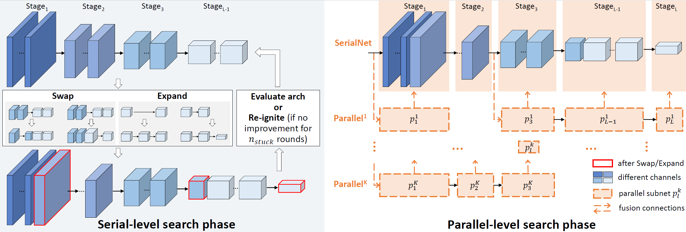

# SP-NAS (Serial-to-Parallel Backbone Search for Object Detection)

## 算法介绍

SP-NAS是面向物体检测及语义分割的高效主干网络架构搜索算法，现有的物体检测器通常采用在图像分类任务上设计和预训练的特征提取网络作为主干网络，因此我们希望通过AutoML技术和网络变形提出了一种高效、搜索空间灵活、任务导向的主干网络架构搜索方案。我们提出了一个从串行（Serial）到并行（Parallel）的两阶段搜索方案，减少重复的ImageNet预训练或者长时间的train from scratch。

## 算法原理

该方法可分为2阶段：

1. 串行阶段通过“swap-expand-reignite”搜索策略找到具有最佳缩放比例和输出通道的block序列，该搜索策略可以完全继承网络变形前的权重；
2. 并行阶段设计了全新的并行网络结构，通过搜索不同特征层次集成的子网络数，更好的融合高级语义和低级语义特征。搜索策略图如下：



## 搜索空间和搜索策略

**串行搜索阶段 Serial-level Search**

- “swap-expand-reignite”策略：从小网络开始生长，避免重复的ImageNet预训练
  - 采用多次“交换”或者“扩展”对网络变形得到新的候选网络；
  - 继承参数快速训练并评估候选网络；
  - 生长到达瓶颈时，对网络进行reignite（ ImageNet 训练），点火次数≤2。

- 限制条件的最优网络：在给定的网络资源（时延，显存占用或复杂度）限制下，挑选能够获得最大效益的串行网络。
- 搜索空间
  - Block类型：基础残差基元Basic Block, 瓶颈残差基元BottleNeck Block和ResNext基元；
  - 网络深度 (depth)：8-60个Blocks；
  - 特征层次阶段数 (stage)：5-7个阶段；
  - 网络宽度 (width)：搜索整个序列中通道大小加倍的位置。

**并行搜索阶段 Parallel-level Search**

- 基于串行搜索阶段的结果SerialNet（or 已有的串行网络如ResNet系列），搜索堆叠在SerialNet上的并行结构，旨在更好地利用和融合来自不同特征层次阶段的，具有不同分辨率的特征信息。
- 搜索策略：资源约束的随机采样，添加额外子网络的概率与待添加子网络的FLOPS成反比。
- 搜索空间：根据特征层次阶段数划分SerialNet为L个自网络，搜索每个阶段堆叠的子网络个数K。

## 使用指导

### 样例1：串行阶段

```yaml
    search_algorithm:
        type: SpNas
        codec: SpNasCodec
        total_list: 'total_list_s.csv'  # 记录搜索结果
        sample_level: 'serial'          # 串行搜索:'serial'，并行搜索: 'parallel'
        max_sample: 10                  # 最多采用结构数
        max_optimal: 5                  # 串行阶段保留Top5种子网络开始变异，并行阶段设为1
        serial_settings:
            num_mutate: 3               # 变异次数
            addstage_ratio: 0.05        # 新增特征层次阶段数的概率
            expend_ratio: 0.3           # 新增block数的概率
            max_stages: 6               # 最大可允许的特征层次阶段数
        regnition: False                # 是否进行过ImageNet regnite
#        last_search_result:            # 是否基于存在的搜索记录开始搜索
    search_space:
        type: SearchSpace
        config_template_file: ./faster_rcnn_r50_fpn_1x.py  #起点网络的config
        epoch: 1                        # 每个采样结构快速训练数
```

### 样例2：并行阶段

```yaml
    search_algorithm:
        type: SpNas
        codec: SpNasCodec
        total_list: 'total_list_p.csv'  # 记录搜索结果
        sample_level: 'parallel'        # 串行搜索:'serial'，并行搜索: 'parallel'
        max_sample: 10                  # 最多采用结构数
        max_optimal: 1
        serial_settings:
        last_search_result: 'total_list_s.csv' # 基于存在的搜索记录开始搜索
        regnition: False                # 是否进行过ImageNet regnite
    search_space:
        type: SearchSpace
        config_template_file: ./faster_rcnn_r50_fpn_1x.py  # 起点网络的config
        epoch: 1                        # 每个采样结构快速训练数
```

### 样例3：fully train

**根据搜索记录完全训练最佳网络**

```yaml
    trainer:
        type: SpNasTrainer
        gpus: 8
        model_desc_file: 'total_list_p.csv'
        config_template: "./faster_rcnn_r50_fpn_1x.py"
        regnition: False                # 是否进行过ImageNet regnite
        epoch: 12
        debug: False
```

**根据网络编码完全训练最佳网络**

```yaml
    trainer:
        type: Trainer
        callbacks: SpNasTrainerCallback
        lazy_built: True
        model_desc_file: "{local_base_path}/output/total_list_p.csv"
        config_template: "./faster_rcnn_r50_fpn_1x.py"
        regnition: False                # 是否进行过ImageNet regnite
        epoch: 12
        debug: False
```

### 算法输出

- 搜索到的模型经充分训练后得到的模型及结果。
- 整个搜索过程中所有模型的结果total_list，以及帕雷托前沿的结果pareto_front.csv。

## Benchmark

Benchmark配置信息请参考: [spnas.yml](https://github.com/huawei-noah/vega/blob/master/examples/nas/sp_nas/spnas.yml)
